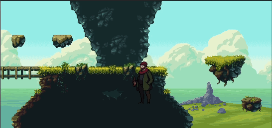

# Eddy

<!-- Import my video from videos/basic-movements-test.mov -->

## Introduction
Meet Eddy, a senior developer who has recently faced a layoff from a top-tier tech giant. Now, Eddy's journey is not just about landing a new job, but also about surviving the challenges that come with it. In this dynamic game, you will help Eddy navigate through phases where he must submit resumes while defending himself from various enemies.

## Gameplay Mechanics
- Objective:  
  Eddy's primary goal is to submit a certain number of resumes in each phase of the game. But the path to his next job isn't straightforward—he must also fend off a series of adversaries.

- Enemies:  
  Eddy faces a variety of foes that threaten his progress, including:
  - The Coach: Offering unsolicited advice that does more harm than good.
  - The English Teacher: Constantly criticizing Eddy’s communication skills.
  - Pyramid Scheme: Tempting Eddy with false promises of quick riches.
  - Gambling Game: A risky distraction that could drain his focus and resources.

- Sanity and Health:  
  To maintain his mental health and continue his journey, Eddy can find and drink special potions—Cachaça 51—which restore his sanity and health, allowing him to keep fighting and submitting resumes.

## Combat System
- Defensive Moves:  
  Eddy can defend against the barrage of distractions and critiques with a variety of attacks, ranging from logical counterarguments to technical expertise that puts his enemies in their place.

- Potion Use:  
  The strategic use of Cachaça 51 is crucial. As Eddy's mental health wanes, a timely drink can restore his focus and energy, helping him to overcome even the most persistent adversaries.

## Conclusion
Guide Eddy through this challenging journey as he strives to rebuild his career, one resume at a time, while battling the demons of unemployment. Will you help Eddy reclaim his place in the tech world, or will the distractions pull him under? The choice is yours!
